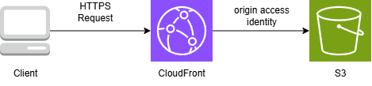

# Terraform AWS Static Website Infrastructure

Infrastructure as Code for deploying a static website on AWS using Terraform.

## Architecture



This project implements a secure access pattern:

```
Client → CloudFront (HTTPS) → Origin Access Identity (OAI) → S3 Bucket (Private)
```

### Key Components

- **S3 Bucket**: Hosts static site content (private access only)
- **CloudFront CDN**: Content delivery with HTTPS enforcement
- **Origin Access Identity (OAI)**: Restricts S3 access to CloudFront only

### Security Features

- S3 bucket is not publicly accessible
- CloudFront accesses S3 via OAI only
- HTTPS enforcement (redirect-to-https policy)
- Bucket policy grants GetObject permission to OAI canonical user ID only

## Requirements

- Terraform >= 1.0
- AWS CLI configured
- AWS Account

## Usage

### 1. Initial Setup

```bash
# Clone the repository
git clone https://github.com/sksr2024/terraform-auto-deploy.git
cd terraform-auto-deploy

# Create terraform.tfvars and set your bucket name
echo 'bucket_name = "your-unique-bucket-name"' > terraform.tfvars
```

### 2. Deploy with Terraform

```bash
# Initialize Terraform
terraform init

# Preview changes
terraform plan

# Deploy infrastructure
terraform apply
```

### 3. Check Outputs

```bash
terraform output
```

Important outputs:
- `cloudfront_domain_name`: Public URL to access your site
- `aws_cloudfront_distribution_id`: Distribution ID for cache invalidation
- `s3_bucket_name`: Bucket name hosting your site

## GitHub Actions CI/CD

This project supports automated deployment using GitHub Actions.

### Setup Steps

1. Go to your GitHub repository: `Settings` → `Secrets and variables` → `Actions`
2. Add the following secrets:
   - `AWS_ACCESS_KEY_ID`: Your AWS access key ID
   - `AWS_SECRET_ACCESS_KEY`: Your AWS secret access key
   - `AWS_REGION`: `ap-northeast-1`
   - `BUCKET_NAME`: S3 bucket name (globally unique)

3. Push to main branch will automatically trigger Terraform deployment

## File Structure

```
.
├── main.tf                      # Main infrastructure definition
├── variables.tf                 # Variable definitions
├── outputs.tf                   # Output definitions
├── terraform.tfvars             # Variable values (gitignored)
├── .github/
│   └── workflows/
│       └── terraform.yml        # CI/CD workflow
├── cloudfront_s3_architecture.png  # Architecture diagram
└── CLAUDE.md                    # Claude Code guidance
```

## Common Commands

```bash
# Format code
terraform fmt

# Validate configuration
terraform validate

# Preview changes
terraform plan

# Apply changes
terraform apply

# Show current state
terraform show

# Display outputs
terraform output

# Destroy infrastructure
terraform destroy
```

## Notes

- CloudFront distribution deployment takes 15-20 minutes
- After uploading content to S3, cache invalidation may be needed for immediate updates
- `terraform.tfvars` may contain sensitive data and is excluded from version control

## License

MIT License
